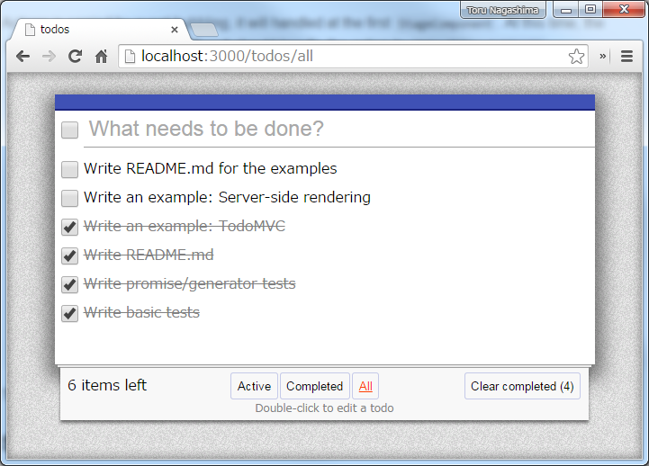

# react-helix-examples

Examples for [react-helix](https://github.com/mysticatea/react-helix) library.

## Installation

```
git clone https://github.com/mysticatea/react-helix-examples.git
cd react-helix-examples
```

## Usage

```
npm start
```

And please open:

* http://localhost:3000/todos/


## Todos



### Overview

Minimal TODO management application.

A keypoint is the way to use `AgentComponent::request` method.

1. First, we import actions to use.

  ```js
  import {updateTodoTitle} from "../action/TodoApp";
  ```

2. Next, we write a class that inherits from `AgentComponent`.

  ```js
  export default class TodoItem extends AgentComponent {
  ```

3. Lastly, we use `this.request` method with toghether the action and parameters.

  ```js
  this.request(updateTodoTitle, id, value);
  ```

That's all, basically.

See Also: [react-helix](https://github.com/mysticatea/react-helix)


### Class Diagram


